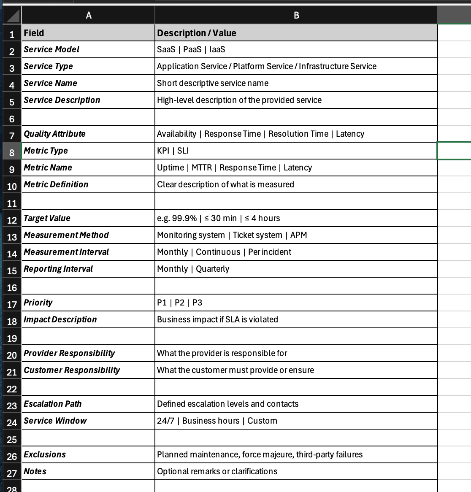

# Service Level Agreements (SLA)

This repository provides a practical, vendor-neutral knowledge base and reusable
templates for designing, understanding, and applying Service Level Agreements (SLAs)
in modern IT and cloud environments.

It is intended for IT practitioners, DevOps engineers, service managers, and
technical consultants.

---

## Purpose

Service Level Agreements define measurable service expectations between service
providers and customers. Properly designed SLAs increase transparency, reduce risk,
and enable objective service evaluation and governance.

This repository focuses on:
- Practical SLA structures
- Industry-relevant metrics and indicators
- Cloud service models (SaaS, PaaS, IaaS)
- Operational and governance best practices

---

## Core Concepts (Overview)

- **SLA (Service Level Agreement)** – Contractual service commitments
- **SLI (Service Level Indicator)** – Measurable service metrics
- **SLO (Service Level Objective)** – Target values for SLIs
- **KPI (Key Performance Indicator)** – Operational performance metrics
- **MTTR / MTBF** – Reliability and recovery indicators
- **Availability & Reliability**
- **Incident Priority & Escalation**
- **Shared Responsibility Model**
- **SLA vs. OLA vs. UC**

Detailed explanations can be found in the `docs/` directory.

---

## Cloud Responsibility Models

SLAs must reflect different responsibility boundaries:

- **SaaS** – Provider manages application and infrastructure
- **PaaS** – Shared responsibility between platform and customer applications
- **IaaS** – Provider delivers infrastructure, customer manages systems and software

---

## Repository Structure

- `docs/` – Concepts, terminology, and best practices
- `templates/` – Practical SLA templates for real-world use
- `exports/` – Optional PDF exports of templates

---

## Disclaimer

This repository provides practical guidance only and does not constitute legal advice.
Always consult legal professionals before using SLAs in production environments.

## References

- ITIL® 4 Foundation – Service Level Management
- ISO/IEC 20000-1:2018 – Service Management Systems
- Google Cloud Architecture Framework – Reliability & SLOs
- AWS Well-Architected Framework – Reliability Pillar
- Microsoft Azure Well-Architected Framework

### Preview of the SLA Excel Template (`sla-template.xlsx`)

